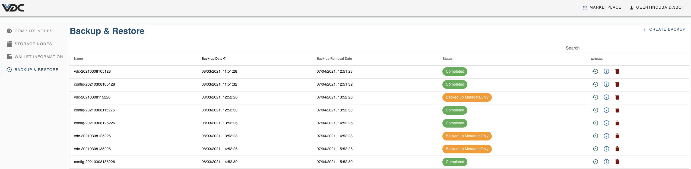

# eVDC Backup and Restore

Each eVDC is backed up at regular intervals (for now daily). Next to these regular backups, also manual back-ups can be made. 
Back-ups are available for 1 month, after which it will be deleted automatically. 

Two types of back-ups are available : 
- entries starting with `config` are the backups of the cluster configurations and secrets
- entries starting with `vdc` are back-ups of the data on the deployed solutions. 
**Remark** : the backups taken will only refer to the eVDC data, not to the persistent storage volumes that are part of the deployed solutions. If these volumes are to be backed up and recovered, they require specific action within the deployed solution. 

> Read more on [__Manual Backup__](evdc_manual_backup)

> Read more on [__Restore__](evdc_restore)

> Read more on [__Delete Backup__](evdc_delete)