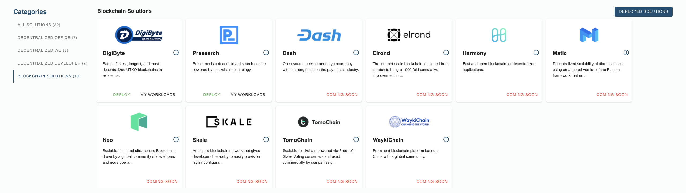

# Blockchain Node Deployment

Blockchains can deploy their nodes on top of the ThreeFold Grid and benefit from a truly decentralized cloud infrastructure. Deploying a node on the ThreeFold Grid can be done in a matter of a few clicks. 

Deploying on top of ThreeFold enables blockchains to achieve more efficiency, scalability and sustainability.

## Blockchain Node Deployment List

- [Digibyte Full Node](evdc_digibyte) 
- [Presearch Node](evdc_presearch) 
- [Polygon Node](evdc_polygon) 

## Coming soon
- CasperLabs
- Dash
- Elrond
- Harmony
- Neo
- Skale
- TomoChain
- WaykiChain