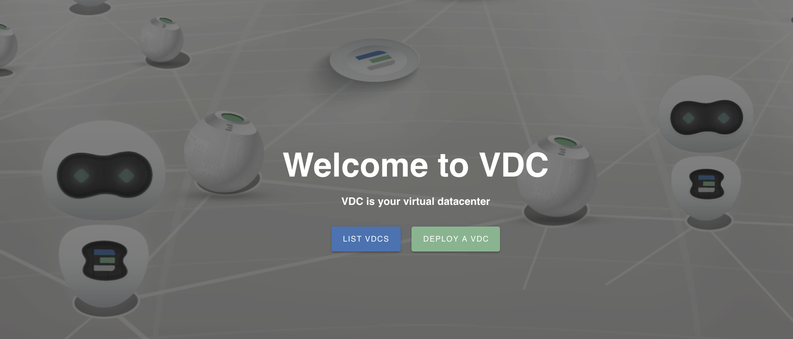
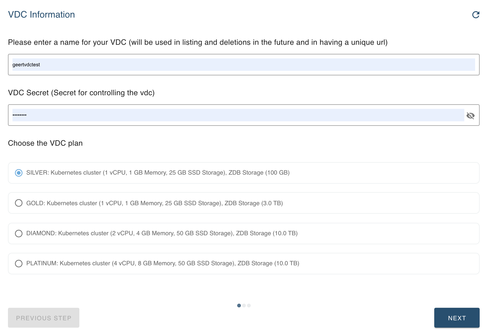
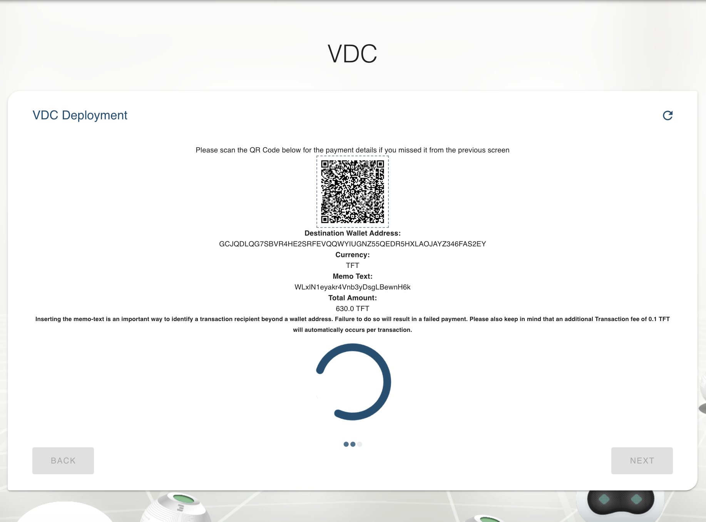
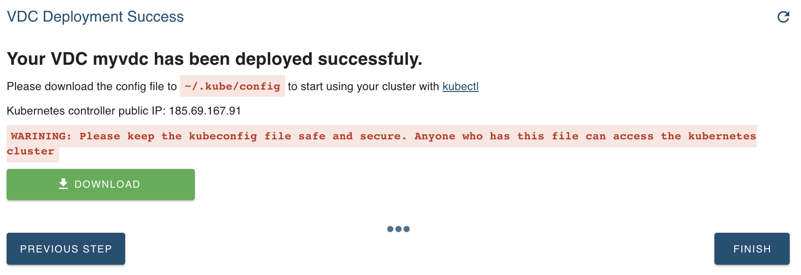

# Add a VDC

You can create your own edge Virtual Data Center in just a few clicks.

Go to the [eVDC deployer website](https://vdc.testnet.grid.tf) and log in using your Threefold Connect App. 
You can find more on ThreeFold Connect [here](sdk:threefold_connect_install).

You'll see the option to deploy your own Virtual Data Center.

## Steps

To create your eVDC, click `Deploy a VDC`.

Only limited information is needed: a name, a secret password, and the size of your eVDC (can be edited over time).  Currently, the cost for VDC resources on testnet comes at 10% of the commercial mainnet cost, making it super affordable.

Now the eVDC is setting up for you.
Full deployment can start after payment.

Pay either by scanning the QR code on the Threefold Connect app (only app available to read the QR info; address, amount, currency and memo text. We can't guarantee that this QR code is readable by other Stellar mobile wallets). 

The amount to be paid is calculated to cover the selected eVDC size capacity for one month.

After payment, the process takes a while, as many steps happen behind the scene:

- The requested capacity is reserved
- The VDC wallets are generated, allowing you to extend the reservation of your capacity
  - A 'prepaid' wallet is accessible both to you and the eVDC provider. This is the wallet that you need to fund
  - A 'provisioning' wallet holds the tokens reserved to pay the farmers according to a predefined plan, ensuring sufficient funding is available for two weeks of operation.
- A public IP is reserved for making your cluster available to the outside world
- A K3S instance of Kubernetes is deployed for your eVDC

After all these steps, your eVDC is ready for exploitation!
A kubeconfig file is generated and can be downloaded.

Remark: keep this file secure and safe, as it contains all info for anyone to access the Kubernetes cluster.

