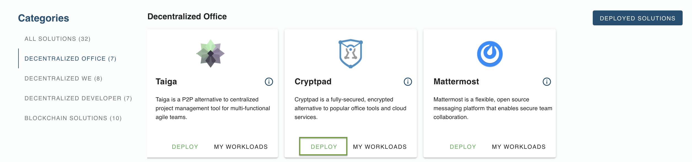
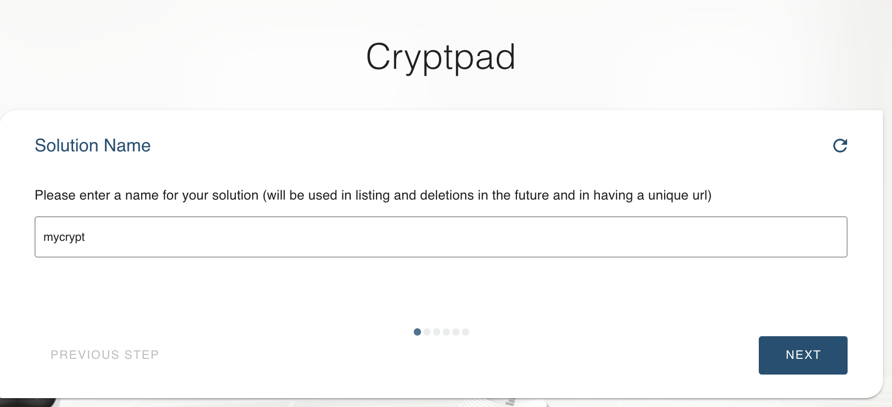
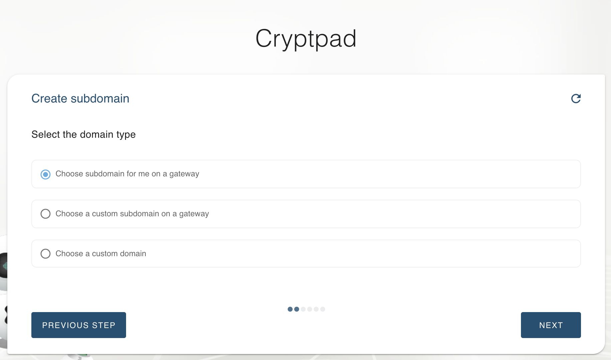
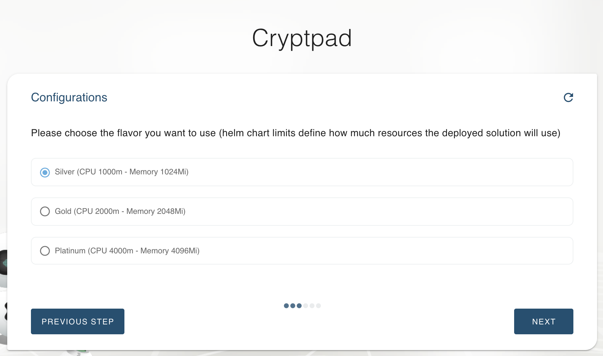
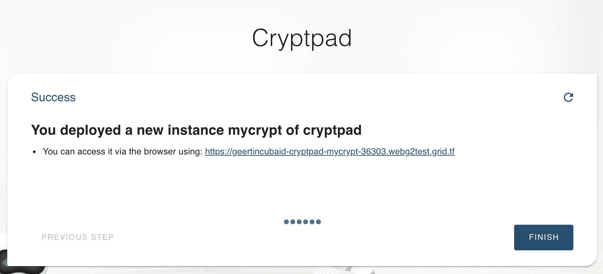
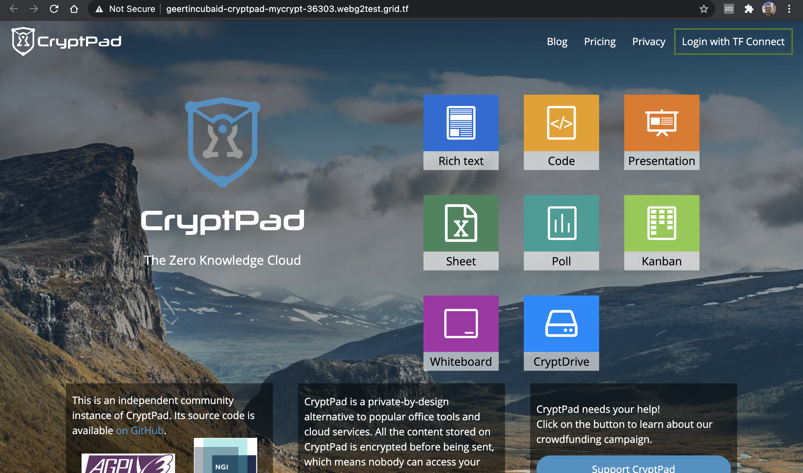
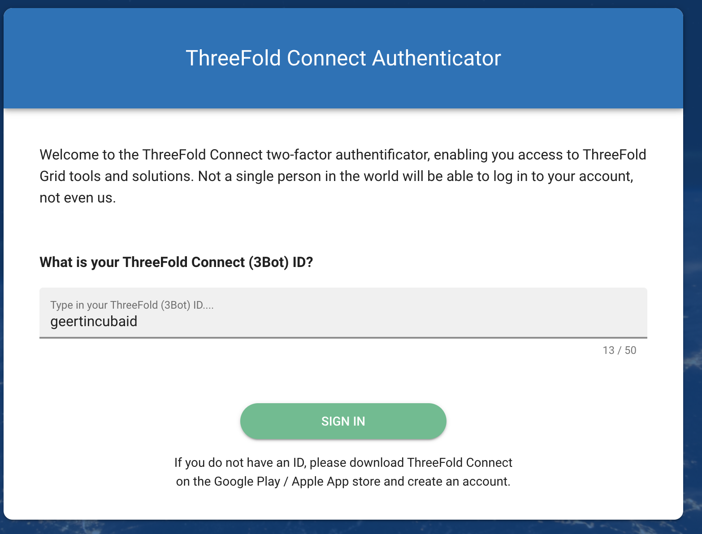
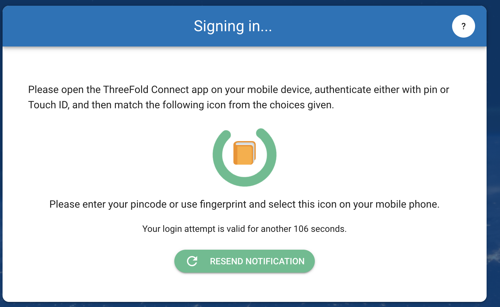
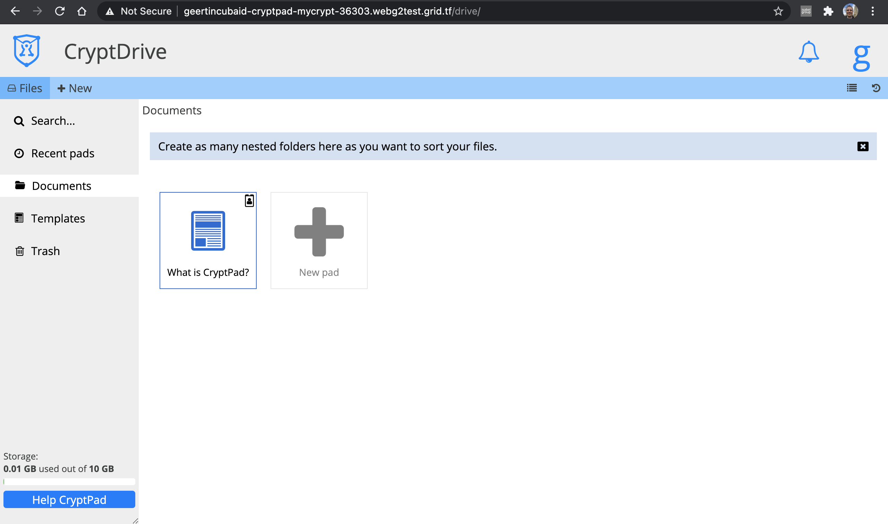

# Deploy Cryptpad in your VDC

[Cryptpad]() is ...

### Getting Started

In the marketplace, click on the `DEPLOY` button. 

Give your solution a name.

You can choose to create a url which is part of your domain, or have one auto-generated. 

 

Choose the size of the capacity that you want to reserve for this solution. 

Now all info is available to create your Cryptpad environment. The url that gives access to it can be found on the next screen, or in the deployed solutions overview.

Now all what remains to be done, is the configuration of your Cryptpad instance.

### Login using ThreeFold Connect App

Login can be done through e-mail access but also using the ThreeFold Connect App 2-factor authentication. 

Click on `Threefold Connect`, and use the Threefold Connect app on your mobile device to tap the corresponding emoji. 

Once you've done that, you're connected and you can start creating and sharing your private documents. 

