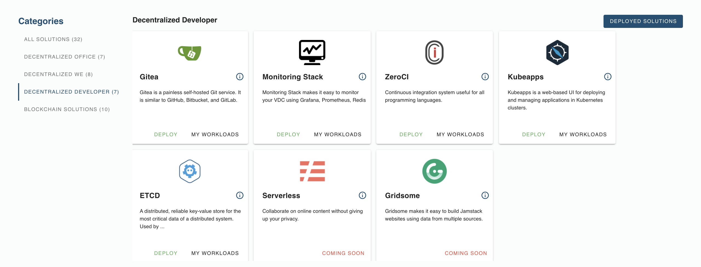

<!--- Todo

- add # Title
- add # Intro: explain what evdc developers tools means, what are they for.
- add # Solution List: list all solutions under evdc odevelopers in bullet points, plus link to deployment tutorial
    for example: 
     Gitea: a peer to peer  git service for solution deployment. [Deployment Manual](evdc_gitea)
- See [evdc_blockchain.md](evdc_blockchain) for example on how this looks like. --->

# Decentralized Developer

...

## Solutions List

- [Gitea](evdc_gitea) : 
- [Monitoring](evdc_monitoring_stack) : 
- [ZeroCI](evdc_mattermost)
- [Kubeapps](evdc_kubeapps)
- [ETCD](evdc_crm)
- [Serverless]()
- [Gridsome]()