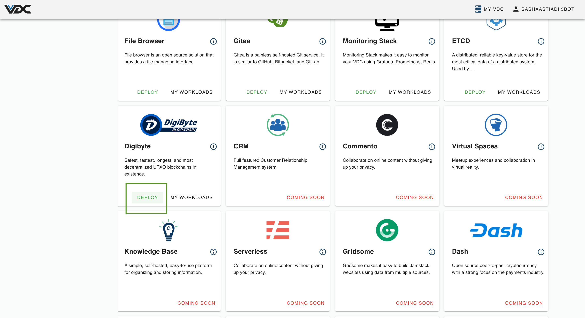
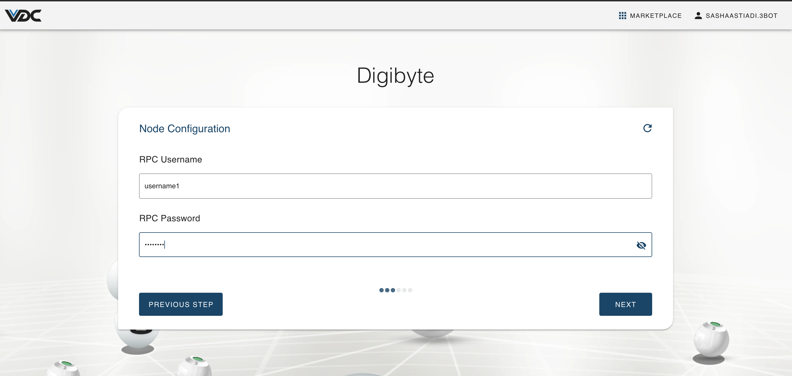
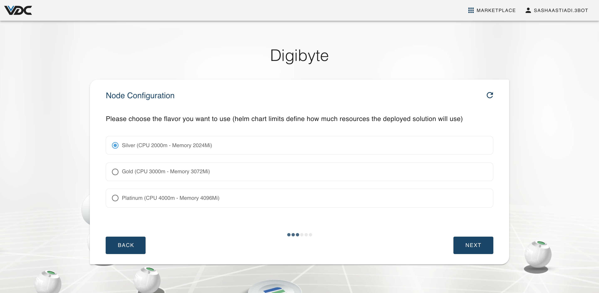
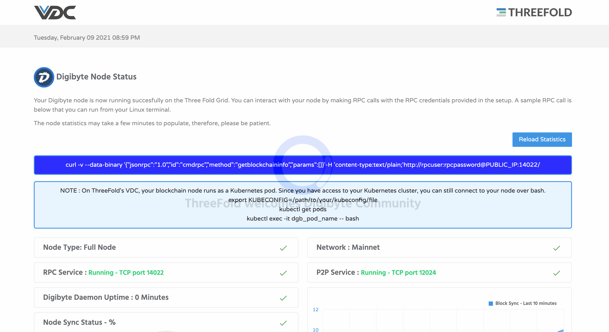
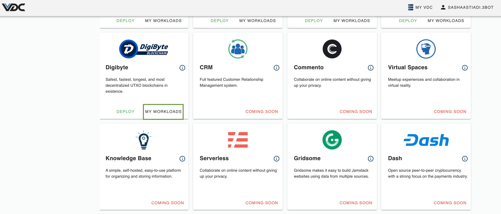
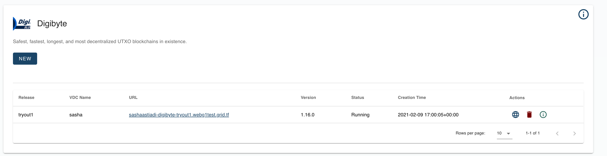

# Deploy a Digibyte Node

Decentralize the [DigiByte](https://digibyte.org/) network by deploying a DigiByte node on ThreeFold P2P Cloud. 

Anyone can contribute and build upon the DigiByte Blockchain using the ThreeFold P2P Cloud. The available developer tools provide significant advantages over centralized cloud providers.

Any server, computer, tablet or mobile phone connected to the DigiByte network becomes a node that helps relay transactions of the DigiByte blockchain.

# Get Started

When logged in to eVDC, find the `DigiByte` widget in Marketplace, on your admin panel and click on the `Deploy` button. 

You will be directed to a chat flow for the deployment process.

Create a name for your DigiByte node. This name will be used to identify your deployment on your `Deployed Solutions` list.

You can choose to create a URL which is part of your domain, or have one auto-generated.

Select the domain type for your Cryptpad:
- For deployment with **random subdomain**, select `Choose subdomain for me on a gateway`. 
- For deployment with a particular **available subdomain**, select `Choose a custom subdomain on a gateway`. 
- To host a blog using **your own domain**, select `choose a custom domain`.

Create a username and password to access your DigiByte Node.

Choose the size of the capacity that you want to reserve for this solution, both in terms of compute power and memory capacity. 

The platinum package is recommended to be able to host the DigiByte blockchain.

Congratulations! You just successfully deployed a DigiByte node. 

The url that gives access to your DigiByte node can be found on the next screen, or in the deployed solutions overview.

When you click it, it will re-direct you to the stats page of your new DigiByte Node. There, you can find all the information you need to start building solutions on top of your DigiByte Node.

To find and access the DigiByte node you just deployed, simply go to the DigiByte widget on your Admin Panel. Click on `My Workloads` to go to the list of your successfully deployed DigiByte nodes.

The link will lead you to your deployed DigiByte node stats page.

