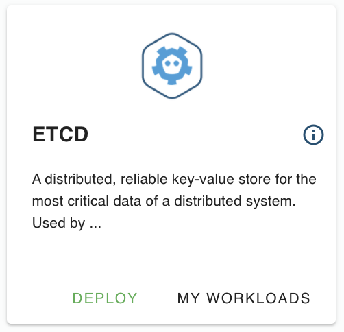
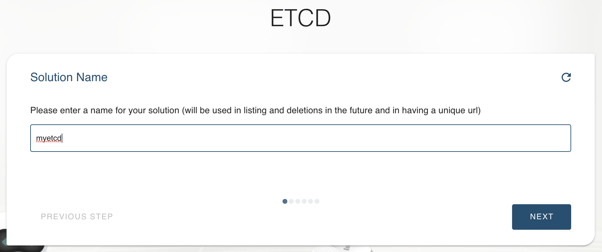
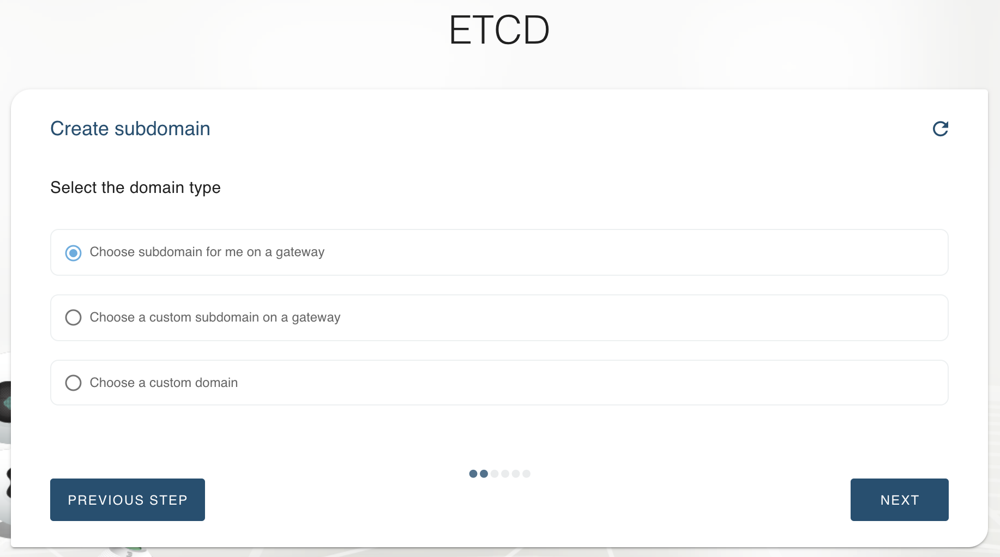
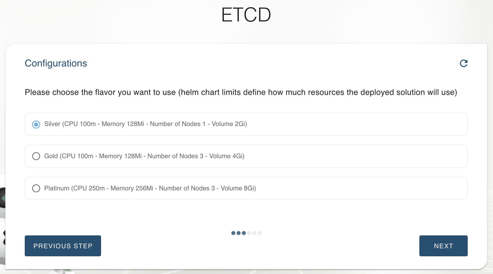
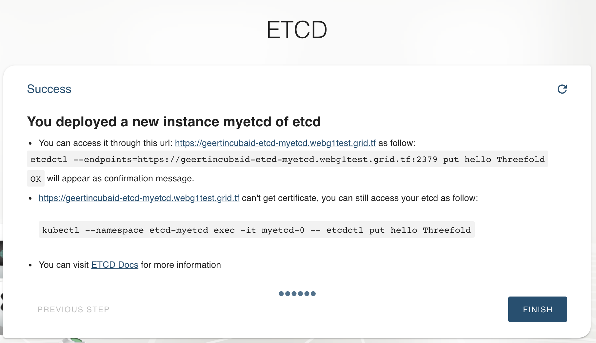

# Deploy a ETCD key-value database in your eVDC

## Requirements

- ...

## Getting Started

Once youre logged in the eVDC, find the __ETCD__ marketplace widget on your admin panel and click on __Deploy__ button.

Create a name for your ETCD instance. This name will be used to identify your deployment on your 'Deployed Solutions' list.

Select the domain for your own website. For deployment with random subdomain, select 'Choose subdomain for me on a gateway',. For deployment with a particular available subdomain, select 'Choose a custom subdomain on a gateway. To host a website using your own domain, select 'choose a custom domain'.

Select the vdc capacity plan for your ETCD 

Congratulations! you just successfully hosted an ETCD instance ThreeFold Grid!

