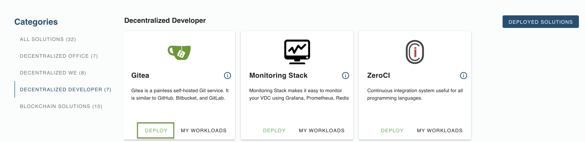
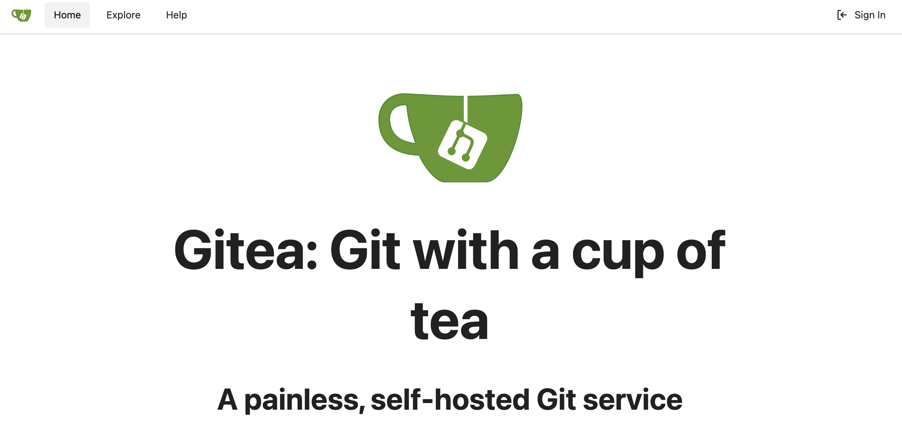
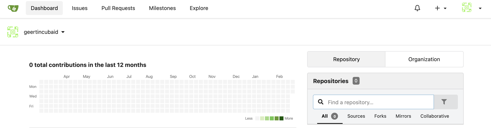

# How to Deploy a Gitea server on eVDC

[Gitea](https://gitea.io/en-us/) is a painless, self-hosted Git service. It is similar to GitHub, Bitbucket, and GitLab. Gitea is a fork of Gogs.

## Getting Started

You can now deploy your own Gitea server via the ThreeFold Marketplace's dashboard on your eVDC admin panel in a few clicks.

First step, find the **Gitea Widget** on the marketplace and click on **'Deploy'** button. You will now will be directed to the chatflow of the deployment process.

Create a name for your solution. This name will be used to identify your deployment on your `Deployed Solutions` list.

Select the domain type. For deployment with random subdomain, select `Choose subdomain for me on a gateway`. For deployment with a particular available subdomain, select 'Choose a custom subdomain on a gateway. To deploy a Gitea server using your own domain, select `choose a custom domain`.

Select the VDC capacity plan for your Gitea server workload usage. This plan depends on the amount of workload you intend to store on the 

Congratulations! you just successfully deployed a Gitea server on the ThreeFold_Grid! You can now click on the given link to access it.

When you clicked it, you will then be directed to the Gitea login page.

## Log in using ThreeFold Connect App

The deployed version allows for a very easy login using the two-factor authentied login using the ThreeFold Connect app.

Click on `Sign In` in the upper right corner of your screen, and then fill in the ThreeFold / 3Bot ID that you created. 

Press `Sign In`. You will see a screen with an emoji and a corresponding one on your mobile device. Type your password on your smartphone, or authentify yourself with the biometrics credentials in the app. And click on the emoji that matches the emoji on the login screen on your computer.

You're ready to start coding, sharing and using your Gitea server in all its aspects !

## Accessing Your Deployed Solution

To find and access the Gitea server you just deployed, simply go to your eVDC Admin Panel home and find the Gitea Widget. Click on **My Workloads** to go to the list of your successfully deployed Gitea instance.

You can now click the link to go to your deployed Gitea.

 