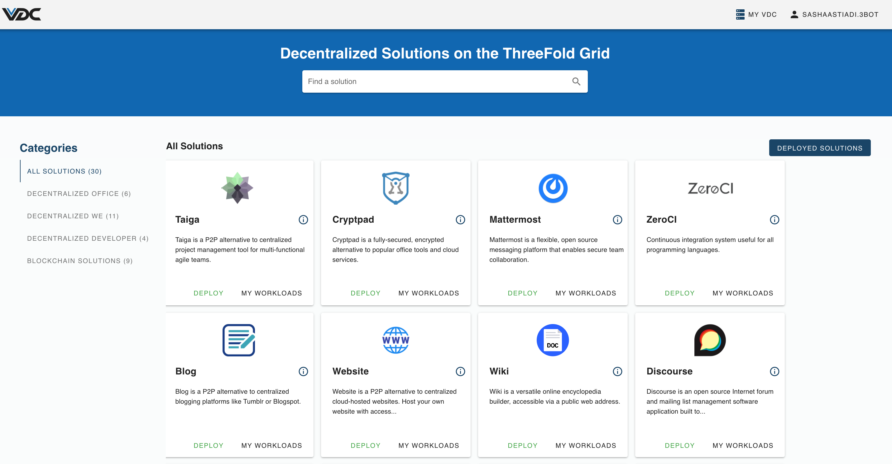

# eVDC Marketplace

`Marketplace` allows you to deploy workloads onto your VDC.

Through this panel, you can easily deploy and manage pre-configured applications in your VDC. Deployment on these solutions is only a few clicks away. 

The list contains both peer-to-peer applications and off-the-shelf tooling to manage your Kubernetes cluster.

## Functionalities

- [TF Marketplace Solutions in your eVDC](evdc_tfnow)

## Getting Started

You'll first need to deploy an eVDC to get started with the Marketplace. Learn how to do that [here](evdc_deploy).

Once you deploy your eVDC, the Marketplace will be your default view on the admin panel.