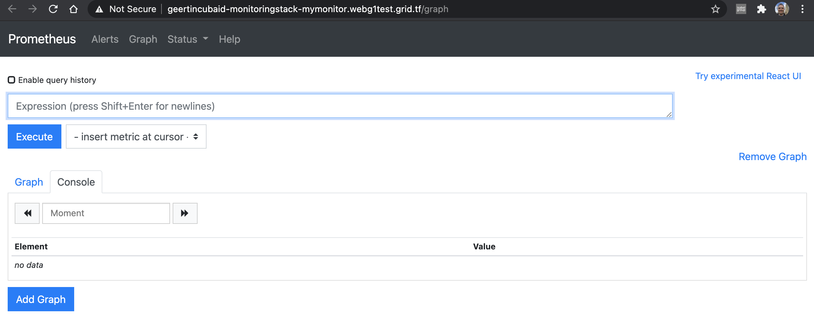
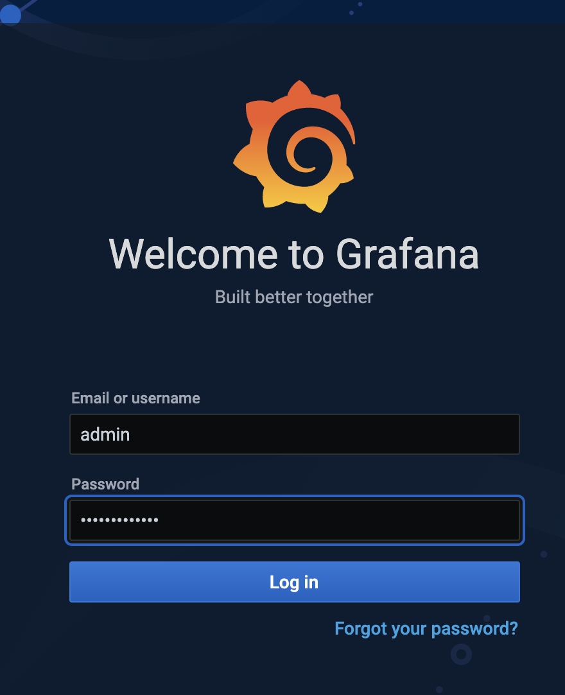
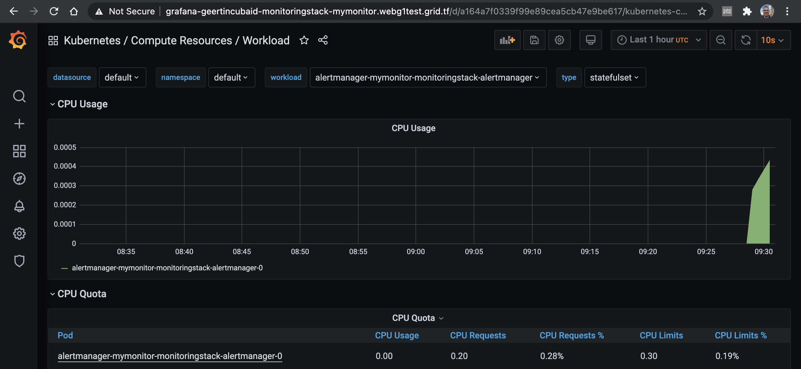

# Monitor Kubernetes Clusters using Monitoring Stack

<!--- TODO 
- intro: what is monitoring stack what are included in monitoring stack
- explain what is prometheus, what's the use / what can it monitor
- explain what is grafana , what can it monitor, what's the use / what can it monitor
- requirements: explain requirements
- getting started explain deployment steps
- use case: give 1 example of monitoring on the deployed  grafana / prometheus
-------------->
You can monitor the health of the VDC you deploy. A stack has been prepared that offers monitoring through Prometheus and Grafana. A Helm chart `kube-prometheus-stack` is available, which offers Prometheus and Grafana as tooling to monitor your VDC. 

## What is Prometheus

[Prometheus](https://prometheus.io/) is a free software application used for event monitoring and alerting. It records real-time metrics in a time series database (allowing for high dimensionality).

## What is Grafana

[Grafana](https://grafana.com) has become the world’s most popular technology used to compose observability dashboards with everything from Prometheus & Graphite metrics to logs and application data to power plants and beehives.

## Getting Started

The monitoring stack is available as a solution in the marketplace. 

Click `Deploy` and go through a simple chat flow to configure the monitoring on your cluster. 

A few elements need to be provided. 
First, give your monitoring the name you want (it will be part of the url).

You can configure the URL to be auto-generated or part of your domain. 

This information is enough to prepare the Monitoring Stack. 

Choose the size of the hardware to be reserved for your monitoring solution. 

Now there is enough information to set up the monitoring stack on your Kubernetes cluster. 

And that's it: the URLs are available to access your monitoring solution, with both UIs on Prometheus and Grafana. 

> For the installation of Kubernetes monitoring on your local machine, please read [__Local Monitoring__](evdc_monitoring_local)).

