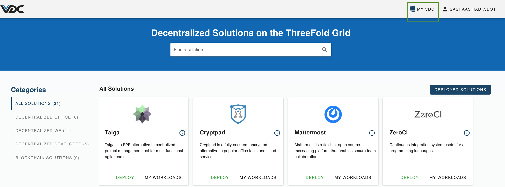

# My VDC Panel

You can easily access My VDC page by simply clicking on `My VDC` button on your eVDC Admin Panel's top right corner.

The `My VDC` panel gives an overview of the resources that make up your Kubernetes cluster - compute and storage nodes. It also manages the wallet that is setup specifically for this eVDC.

The `COMPUTE NODES` section of the `MY VDC` screen shows you the created Kubernetes clusters corresponding to your package.

Details on both master and worker nodes are visible there.

In the `STORAGE NODES` section of the `MY VDC` screen shows you the reserved hard disks that will store the different shards of your workloads and files. 

## Functionalities

- [Manage Compute Nodes](evdc_compute)
- [Manage Storage Nodes](evdc_storage)
- [eVDC Wallet](evdc_wallet)
- [eVDC Backup & Restore](evdc_backup_restore)
- [Manage your Kubernetes Cluster](evdc_k8s)
