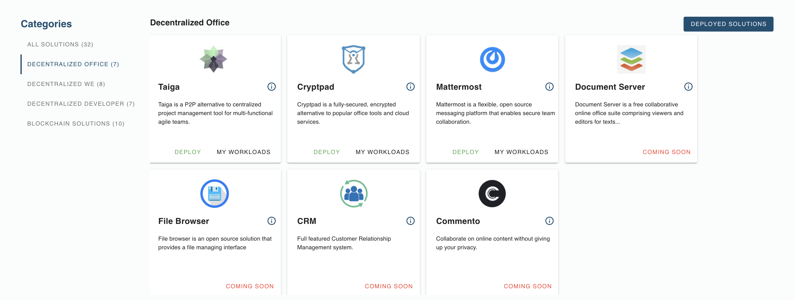

<!-- Todo

- add # Title
- add # Intro: explain what evdc office tools
- add # Solution List: list all solutions under evdc office in bullet points, plus link to deployment tutorial
    for example: 
     File Browser: a peer to peer file storage system. [ Deployment Manual ](link)
- See [evdc_blockchain.md](evdc_blockchain) for example on how this looks like. --->

# Decentralized Office

Decentralized Office ...

## Solutions List

- [Taiga](evdc_taiga) : 
- [Cryptpad](evdc_cryptpad) : 
- [Mattermost](evdc_mattermost) : 
- [Document Server - to do]() : 
- [File Browser - to do]() : 
- [CRM](evdc_crm) : 
- [Commento - to do]() : 
