# How to Deploy a Polygon Node on eVDC

[Polygon](https://polygon.technology), formerly called Matic network, is a protocol and a framework for building and connecting Ethereum-compatible blockchain networks.
It using an adapted version of the Plasma framework that empowers Ethereum-based DApps with the high-speed and extremely low-cost transactions required to achieve mass adoption.

# System/VDC Requirements 

Minimum system requirements for a Matic node are: 
- 16 GiB of memory
- 4 core CPU 
- 60 GB disk space (and extendable)
- 2 different machines for Sentry and Validator node. Having a single machine to run both, the Sentry and Validator nodes will run into issues. 

**Remark** : 
The minimum system requirement of 60 GB of hard drive storage is the reason it will only run on a Diamond VDC, or a silver/gold/platinum version that has been upgraded with more storage.

# Get Started

You can deploy a Polygon node on the TFGrid with a few clicks. The widget enables both running a Sentry node, a full node and a validator node. We will explain the different steps to obtain each of these node types. 

First step, find the **Polygon Widget** on the marketplace and click on **'Deploy'** button. You will now will be directed to the chatflow of the deployment process.

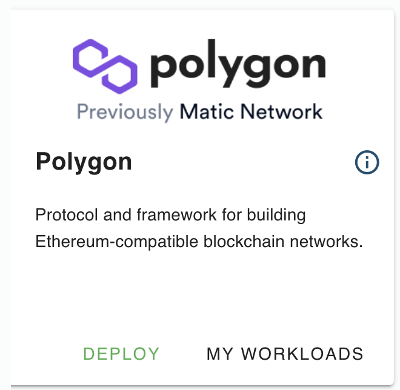

Create a name for your new node deployment. This name will be used to identify your deployment on your 'Deployed Solutions' list.

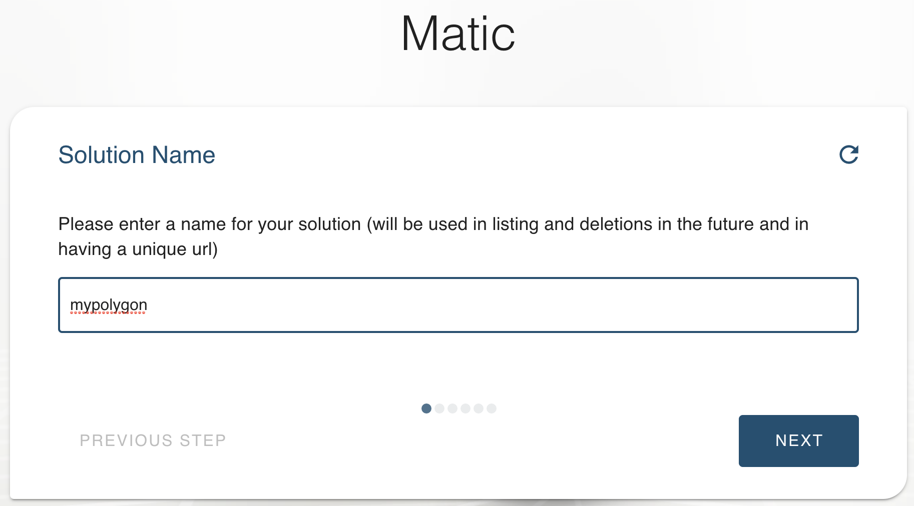

Select the domain type for your Polygon Node. For deployment with random subdomain, select `Choose subdomain for me on a gateway`. For deployment with a particular available subdomain, select 'Choose a custom subdomain on a gateway. To deploy a Polygon Node using your own domain, select 'choose a custom domain'.

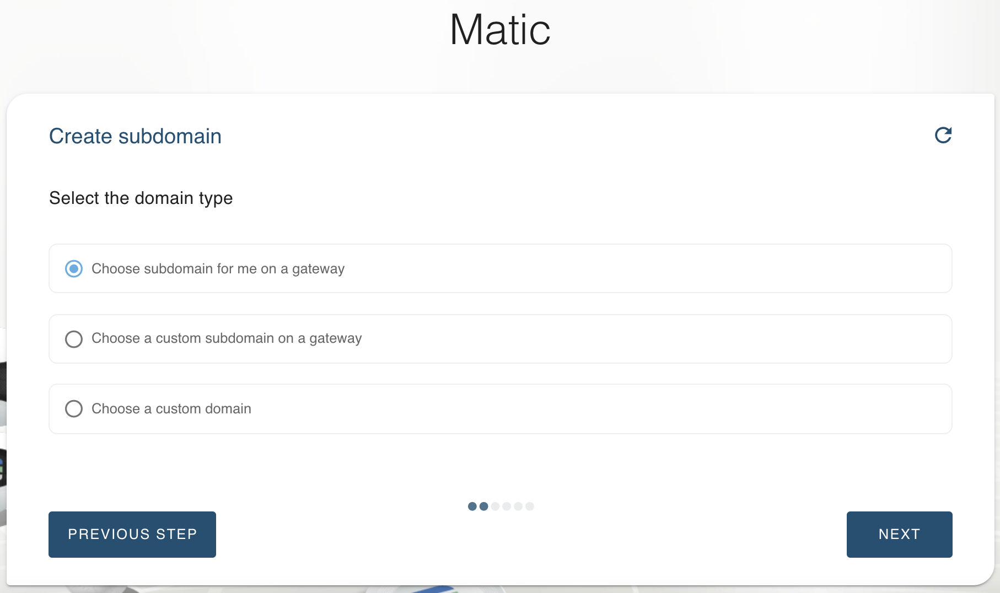

Select the VDC capacity plan for compute and memory for your Polygon Node. 

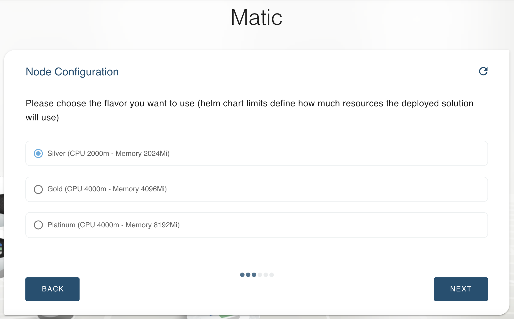

Choose a password and remember it. It will be needed to access your node's web page. 

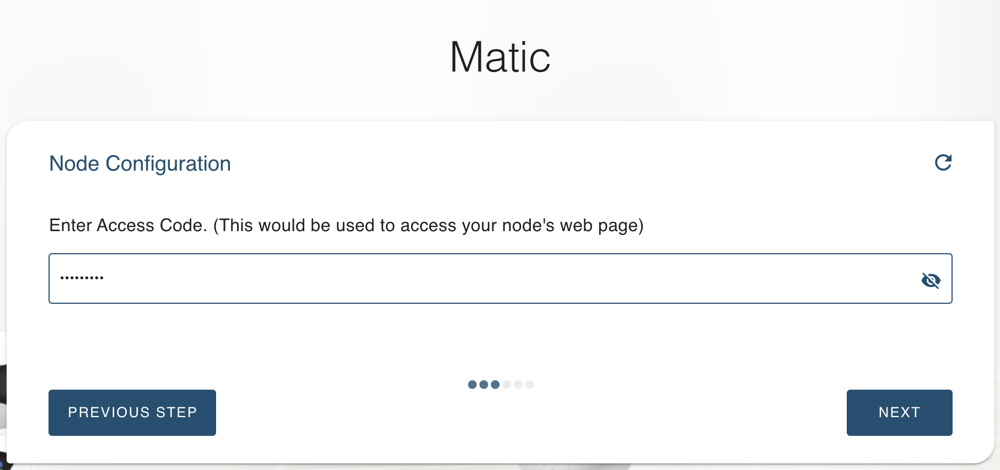

The next field is only needed if you intend to deploy a full node. If so, fill in the RPC URL to Ethereum. If you leave this field blank, a Sentry node will be generated. 

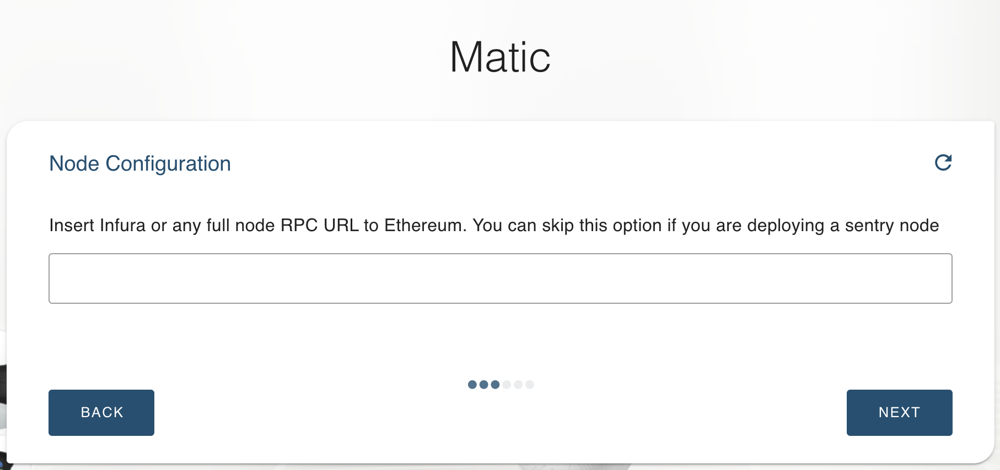

Congratulations! you just successfully deployed a Polygon/Matic Node on the ThreeFold_Grid! You can now click on the given link to access your new Node.

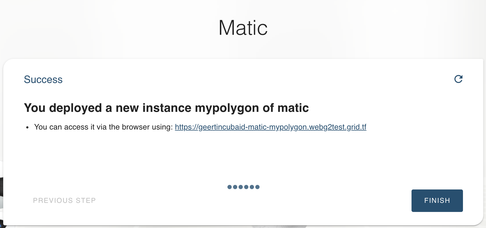

Clicking on this url will lead you to the stat page of your node, where you can find all the information you need to monitor your node, including the log data showing your node activity. 

The `Refresh` button reloads the webpage. 

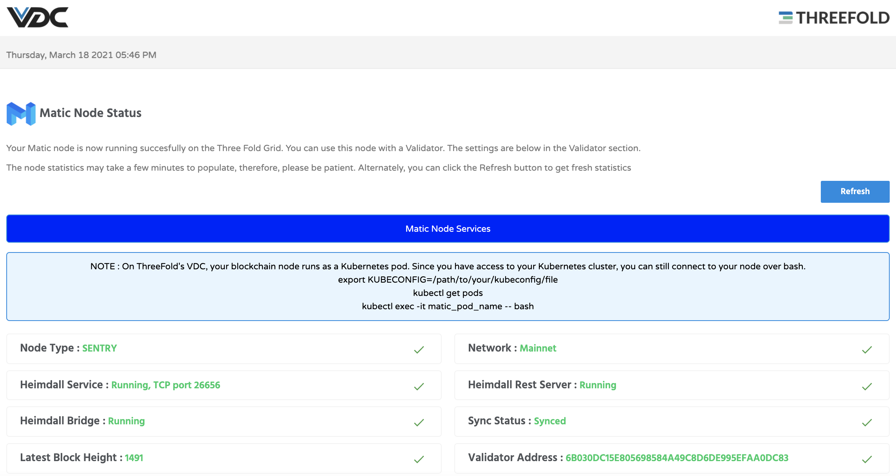
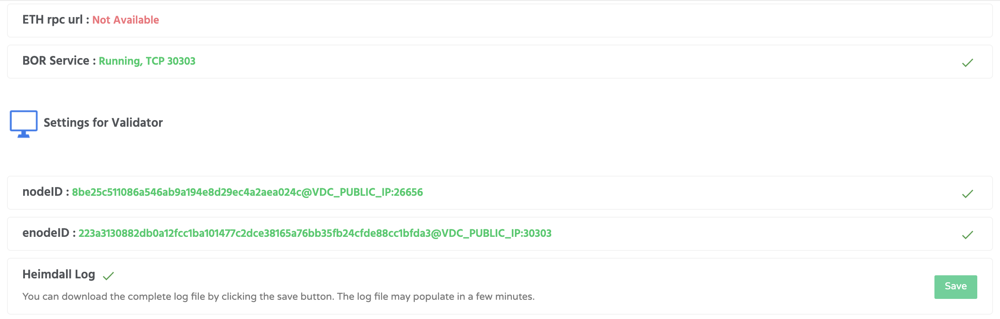
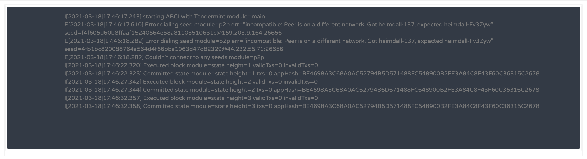
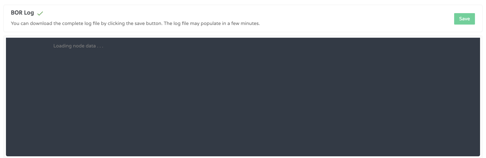

## Convert your node into a Validator node

COMING SOON

## Accessing Your Deployed Node

To find and access the Polygon Node you just deployed, simply go to your eVDC Admin Panel home and find the Polygon Widget. Click on **My Workloads** to go to the list of your successfully deployed Polygon Node.

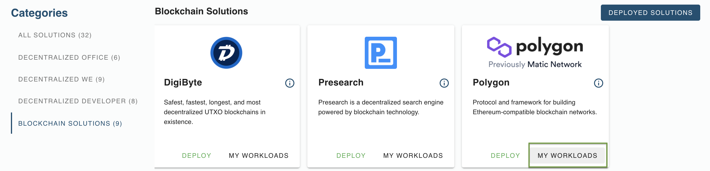 

You can now click the link to go to your deployed Polygon Node Stats Page.

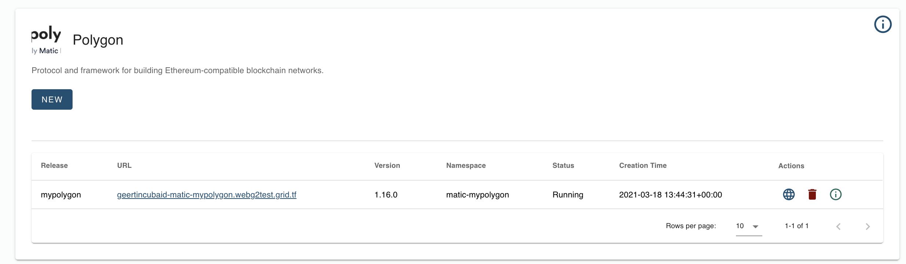 