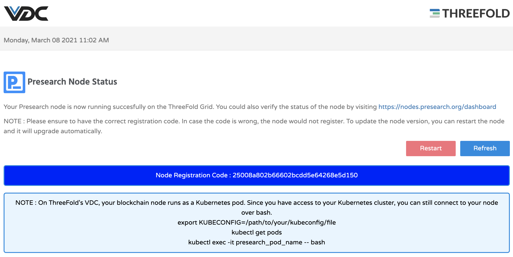

# How to Deploy a Presearch Node on eVDC

[Presearch](https://presearch.io)'s values are aligned with ThreeFold's mission to enable a decentralized and open internet.

ThreeFold helps you to operate a Presearch Node and to power, the Presearch decentralized search engine. You can set up a node within just a few clicks.

Presearch Nodes are used to process user search requests, and node operators earn Presearch PRE tokens for joining and supporting the network.

# Get Started

You can now deploy your Presearch search Node via the ThreeFold Now Marketplace's dashboard on your eVDC admin panel in a few clicks.

First, find the **Presearch Widget** on the marketplace and click on **'Deploy'** button. You will now be directed to the chat flow of the deployment process.

Create a name for your new node deployment. You will use this name to identify your deployment on your 'Deployed Solutions' list.

Select the domain type for your Presearch Node. For deployment with random subdomain, select `Choose subdomain for me on a gateway`. For deployment with a particular available subdomain, select 'Choose a custom subdomain on a gateway. To deploy a Presearch Node using your own domain, select 'choose a custom domain'.

Copy your registration code from your Presearch account.

Paste this code into the text field when requested.

Select the vdc capacity plan for your Presearch Node workload usage. For now, the smallest size (silver) is sufficient.

Congratulations! you just successfully deployed a Presearch Node on the ThreeFold_Grid! You can now click on the given link to access your new Presearch Node.

When you clicked it, you will then be directed to the Node stat page of your node where you can find all the information you need to monitor your node, including the log data showing your node activity. 
The node normally restarts with updates of the images and restarted manually with the `Restart` button. 
The `Refresh` button reloads the webpage. 

## Accessing Your Deployed Node

To find and access the Presearch Node you just deployed, simply go to your eVDC Admin Panel home and find the Presearch Widget. Click on **My Workloads** to go to the list of your successfully deployed Presearch Node.

You can now click the link to go to your deployed Presearch Node Stats Page.

Also on the [Presearch website](https://nodes.presearch.org/dashboard) you can now see the node. Stake at least 1000 PRE and your node becomes accessible for searches.

