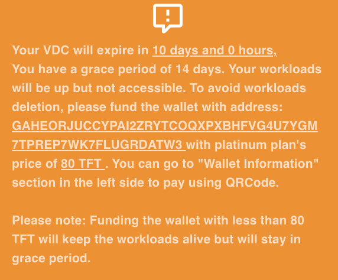

# Payment and Billing

## Price

A eVDC comes in different shapes. The price of the monthly subscription fees is expressed here in EUR. The equivalent amount in TFT at a TFT price of 0.10 USD will be billed.

- Silver: 10 EUR per month for 100GB S3 Storage, a Network Gateway, Monitoring, a Kubernetes Controller and 1 Kubernetes node (small)
- Gold: 30 EUR per month for 3TB S3 Storage, a Network Gateway, Monitoring, a Kubernetes Controller and 1 Kubernetes node (mid)
- Diamond: 60 EUR per month for 10TB S3 storage, a Network Gateway, Monitoring, a Kubernetes Controller and 2 Kubernetes nodes (mid)
- Platinum: 250 EUR per month for 20TB S3 storage, a Network Gateway, Monitoring, a Kubernetes Controller and 2 dedicated Kubernetes nodes

**Note:** Above pricing is for Mainnet. Testnet pricing will be 1/10 of the Mainnet pricing. Please take into consideration that Testnet is not meant for production: continuity of operation for your VDC is not guaranteed, and the available capacity is inferior to the mainnet one.

### Adding nodes

For additional Kubernetes node, following prices apply:

- 5 EUR for a small node: 1vcpu, 2 GB mem, 25 GB max storage
- 10 EUR for a mid node: 2vcpu, 4 GB mem, 50 GB max storage
- 20 EUR for a big node: 4vcpu, 8 GB mem, 50 GB max storage

## Billing

A user prepays the setup of his eVDC to a eVDC provider, according to the above prices.
Once paid, provisioning of hardware for Kubernetes clusters can start.

## Top up

After creation of your VDC, you have transferred an amount that is sufficient for your VDC to remain up and running for 1 month. 

2 weeks before expiration, you will receive a request to top up your wallet, so that it has the sufficient funding available to remain available. 

You can top up your VDC wallet by transferring TFTs to the indicated address, or by scanning the QR code in the `Wallet Information`.

## How to buy TFT

All info on how to buy TFT can be found [here](threefold:how_to_buy_and_sell)
