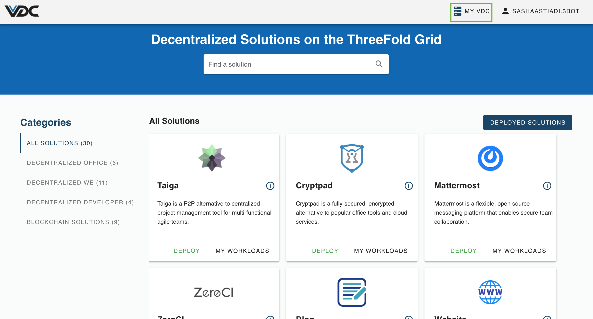
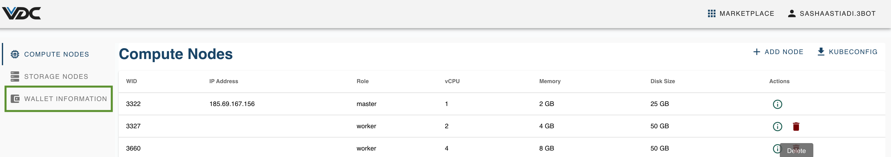
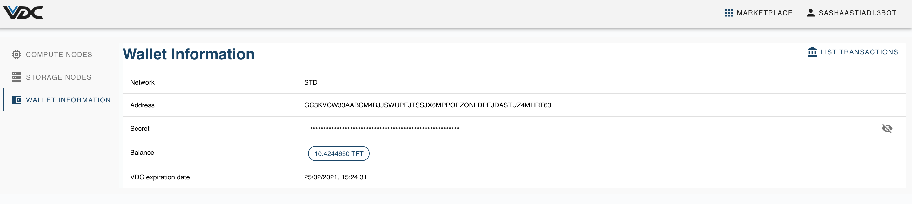

# How to Access Your eVDC Wallet

Once you're logged in the eVDC, click on `My VDC` on the top right corner of the navigation bar of your eVDC admin panel.

You will be directed to your eVDC Management page. Click on `Wallet Information` on the left sidebar

You will then be redirected to your eVDC Wallet page.

More Info:
- How to [Top-up Your TFT Balance onto Your eVDC Wallet](evdc_wallet_topup).
- How to [Import your eVDC Wallet to an External Wallet](evdc_wallet_import).
- Go back to ['eVDC Management' Manual](evdc_manage).
