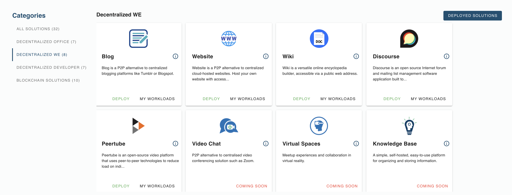

# Decentralized We

Decentralized We is all about providing alternatives to the tools we use every day to share and connect with the people around us. These are secure and safe communication and publishing tools to ensure that what we share privately stays private and what we share publicly is still owned by us. 

## Solutions List

- [__Blog__](evdc_blog) : a P2P alternative to Tumblr or Blogspot
- [__Website__](evdc_website) : a P2P alternative to centralized cloud-hosted websites. Host your own website with access via an IP and a public domain
- [__Wiki__](evdc_wiki) : create your online encyclopedia accessible via an IP and a public domain
- [__Discourse__](evdc_discourse) : an open source forum built to educate members about civil community engagement
- [__Peertube__](evdc_peertube) : an open-source video platform that uses peer-to-peer tech to reduce load on individual servers when viewing videos
- [__Video Chat__](evdc_videochat) : a peer-to-peer video chatting platform 

Coming soon :
- __Mozilla Hubs__ Virtual Space 
- __Bookstack__ Knowledge Base
