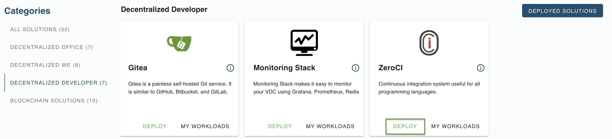
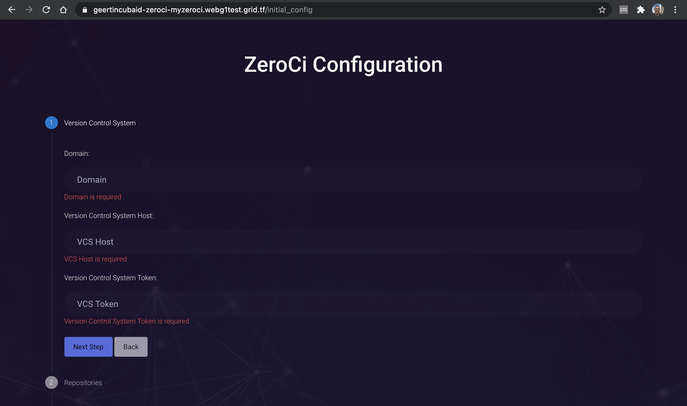
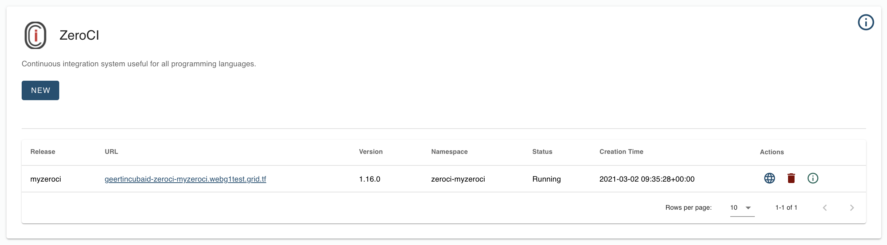

# How to Deploy a ZeroCI server on eVDC

[ZeroCI](https://github.com/threefoldtech/zeroCI) is ThreeFold's continuous integration tool for developers looking to build on top of the decentralized ThreeFold Grid.

It is useful for all languages, though it has some more specific features for Python projects that generates test summary into xml file. It is integrated with version control systems and Telegram.

## Getting Started

You can now deploy your ZeroCI server via the ThreeFold Marketplace's dashboard on your eVDC admin panel in a few clicks.

The first step, find the **ZeroCI Widget** on the marketplace and click on the **'Deploy'** button. You will be directed to the chat flow of the deployment process.

Create a name for your solution. This name will be used to identify your deployment on your `Deployed Solutions` list.

Select the domain type. For deployment with a random subdomain, select `Choose subdomain for me on a gateway`. For deployment with a particular available subdomain, select 'Choose a custom subdomain on a gateway. To deploy a ZeroCI server using your domain, select `choose a custom domain`.

Select the VDC capacity plan for your ZeroCI server workload usage. This plan depends on the amount of workload you intend to store on the 

Congratulations! you just successfully deployed a ZeroCI server on the ThreeFold_Grid! You can now click on the given link to access it.

When you clicked it, you will then be directly requested to log in using your ThreeFold Connect app.

## Log in using ThreeFold Connect App

The deployed version comes with a easy login using the two-factor authenticated login using the ThreeFold Connect app.

Fill in the ThreeFold / 3Bot ID that you created. 

Press `Sign In`. You will see a screen with an emoji and a corresponding one on your mobile device. Type your password on your smartphone, or authenticity yourself with the biometrics credentials in the app. And click on the emoji that matches the emoji on the login screen on your computer.

You're ready to build and configure your Continuous Integration scenarios into ZeroCI!

## Accessing Your Deployed Solution

To find and access the ZeroCI server you just deployed, go to your eVDC Admin Panel home and find the ZeroCI Widget. Click on **My Workloads** to go to the list of your successfully deployed ZeroCI instance.

You can now click the link to go to your deployed ZeroCI.

 