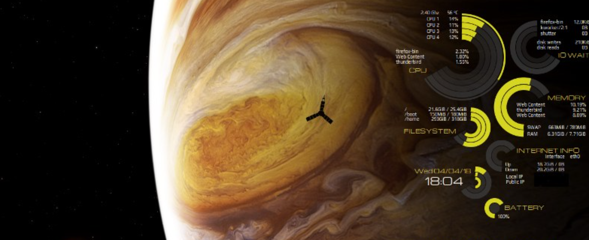
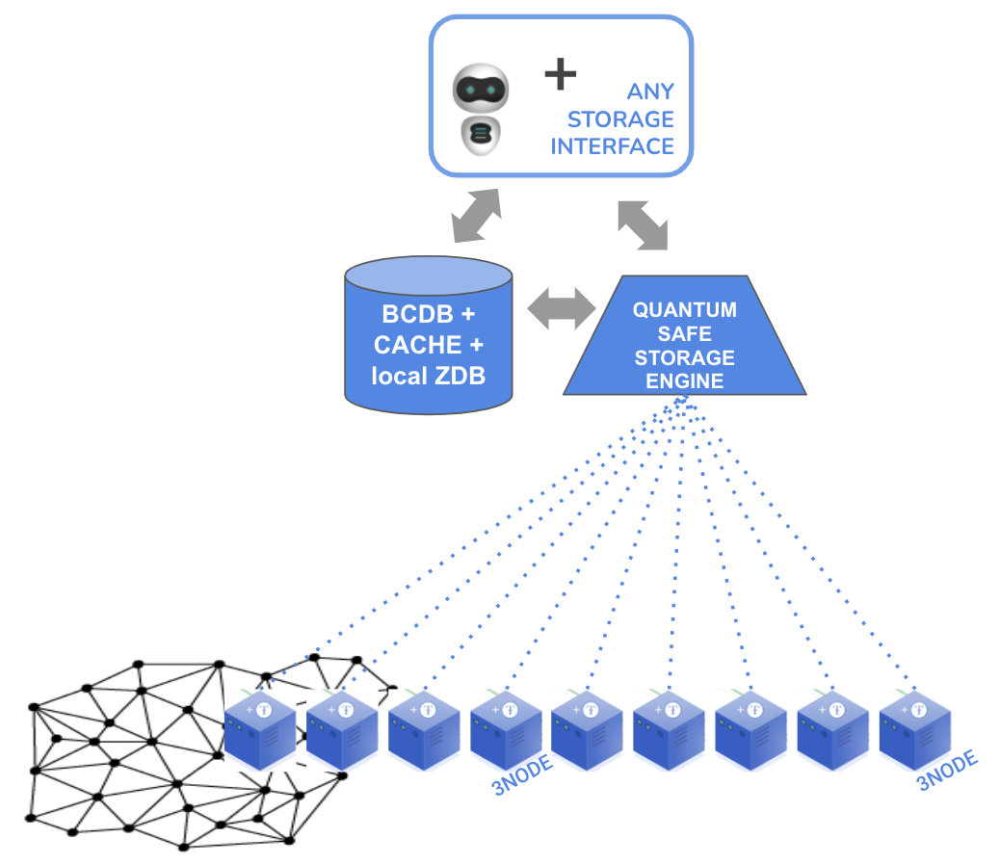
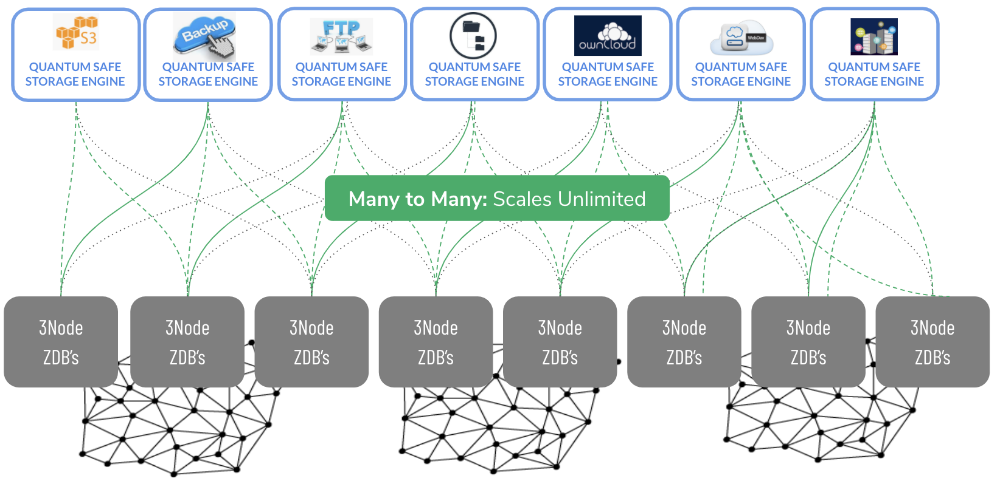
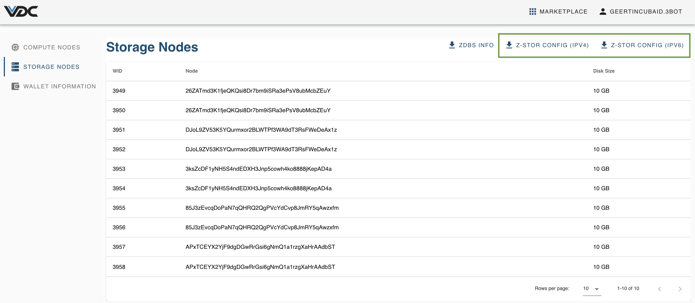
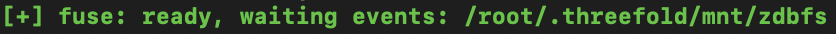
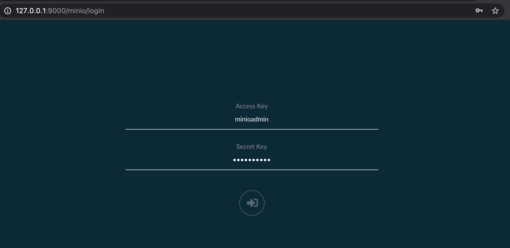

# ThreeFold Planetary Secure File System (PSFS)

Part of the VDC is a set of Storage Nodes, which can be used as storage infrastructure for files in any format. 

## Mount Any Files in your Storage Infrastructure

The Planetary Secure Filesystem is a mechanism to mount any file system (in any format) on the grid, in a quantum-secure way. 

This storage layer relies relies on 3 primitives of the ThreeFold technology : 

- [0-db](https://github.com/threefoldtech/0-db) is the storage engine.
It is an always append database, which stores objects in an immutable format. It allows to
have history out-of-the-box, good performance on disk, low overhead, easy data structure and easy backup (linear copy and immutable files).

- [0-stor-v2](https://github.com/threefoldtech/0-stor_v2) is used to disperse the data into chunks by performing 'forward looking error correcting code' (FLECC) on it and send the chunks to a safe location.
It takes files in any format as input, encrypts this file in AES based on a key user-defined, then FLECC-encodes the file and spreads out the result
to multiple 0-db's. The number of generated chunks is configurable, to make it more or less robust against loss of data through unavailable chunks. Even if some 0-db's are unreachable, the original data can still
retrieved and missing 0-db's can even be rebuilt to keep full consistency. It's an essential element of the operational backup. 

- [0-db-fs](https://github.com/threefoldtech/0-db-fs) is the filesystem driver which uses 0-db as primary storage engine.  It manages the storage of directories and metadata in a dedicated namespace, and file payloads in another dedicated namespace.

Together they form a storage layer which is quantum secure : even the most powerful computer can't hack the system, because it is missing part of the information when breaking into one node. 

This concept scales forever, and any file system can be brought on top of it: 
- S3 storage 
- any backup system
- an ftp-server
- IPFS and Hypercore distributed file sharing protocols 
- ...

## Getting Started

### Install 

Please find below a walkthrough on how to use the Planetary File System to backup your local machine on the ThreeFold Grid. 

First download the ZDB config file. This file can be found in the upper right corner of the `VDC Storage Nodes` screen. 2 configurations are available: an IPv4 and an IPv6 version. 

Let's call this downloaded file `yourzdbsconfig.toml`. 

As described in [Manage Storage Nodes](evdc_storage), this file contains the nodes with attributes and how to access them.  

Download now the Planetary FileSystem bootstrap, available [here](https://github.com/threefoldtech/quantum-storage/releases/download/v0.0.1/planetaryfs-bootstrap-linux-amd64).

> __Remark__: 
For now, the bootstrap is only available as a Linux binary. For deployment on MacOS please install the binary in a Docker and execute this binary inside an Ubuntu machine using the command `docker run -it --cap-add SYS_ADMIN --device /dev/fuse ubuntu:20.04`

For running the container, execute the following command :

`./planetaryfs-bootstrap-linux-amd64 /tmp/yourzdbsconfig.toml`

Execution of this bootstrap will show you that the back-end is ready for dispersing the data. 

--- 
For MacOS users and if port forwarding needed, execute : 

`docker run --rm -it --device /dev/fuse --cap-add CAP_SYS_ADMIN -p 9000:9000 tf/quantum`

As soon as the container is up and running, you can reach it via it's IP. In-built is also a Minio interface, on port 9000. 

A UI for Minio S3 storage is available on the provided IP address. 

