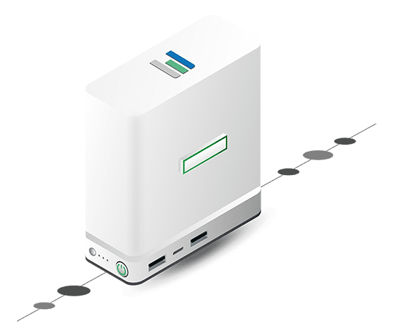

# Cloud Knowledgebase

## eVDC

eVDC stand for "edge Virtual DataCenter" which is a solution that exists on the ThreeFold grid.

The eVDC is a virtual data center (out of the box) that creates easy and industry standard ways to deploy, scale and manage Unix workloads.

The eVDC offers the tooling for :

- Deploying containerized Unix IT applications on the grid
- Setting up Kubernetes clusters that able to orchestrate and manage containers running on the Threefold grid and containers hosted on external clouds (hybrid cloud management)
- Storing data in a very secure way and presenting this storage facility in the most used and understood interface: a file system

## Planetary FileSystem

## IAC = Infrastructure As Code
