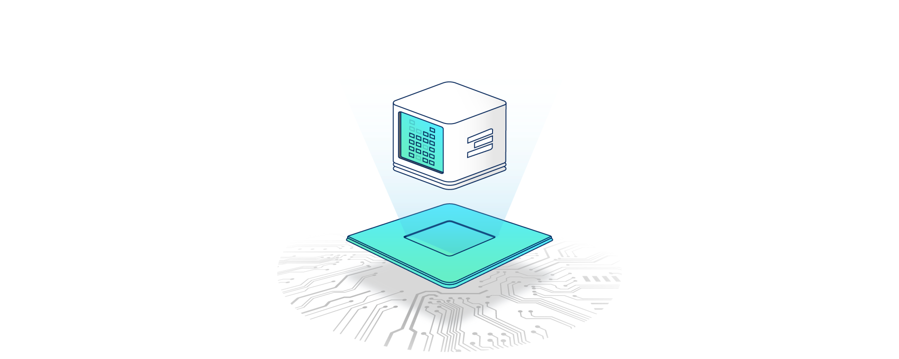

# ThreeFold Peer-2-Peer Cloud Knowledge Base

## eVDC

 

 

eVDC stands for "edge Virtual Data Center" which is a solution that exists on the ThreeFold grid.

The eVDC is a virtual data center (out of the box) that creates easy and industry standard ways to deploy, scale and manage Unix workloads.

The eVDC offers the tooling for:

- Deploying containerized Unix IT applications on the grid
- Setting up Kubernetes clusters that able to orchestrate and manage containers running on the Threefold grid and containers hosted on external clouds (hybrid cloud management)
- Storing data in a very secure way and presenting this storage facility in the most used and understood interface: a file system

 

<!--  -->

 

> For more info see: [eVDC](evdc)

## Planetary FileSystem

<!-- This link to the planetary filesystem does not work. -->
> For more info see: [Planetary Filesystem](threefold:threefold_fs)

## Infrastructure As Code (IAC)

 

 

Infrastructure as code is the process of managing and provisioning computer data centers through machine-readable definition files, rather than physical hardware configuration or interactive configuration tools.

> For more info see: [IAC](iac)