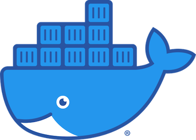

# IT-Standard Compatibility

The IT industry is used to standard tooling for the deployment of their IT workload:

- Docker is the standard for container
- Kubernetes is the standard for container orchestration
  On the TF grid a Kubernetes orchestrator can be deployed out of the box. We have implemented the [K3S](https://k3s.io) implementation, which is full-blown Kubernetes offering, but using only half of the memory footprint, packaged as a single binary and made more lightweight so that it can run in resource-constrained locations (so fit for IoT, edge, ARM etc).
- For storage, any file system will be supported, see our [planetary_filesystem](threefold:threefold:threefold_fs) for more detail.

The process for deploying workloads has been made easy as quite a lot of Helm templates have been made available, ready for usage on the grid.

# Docker

# Helm

# Filesystem