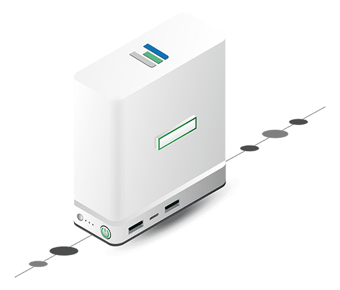

# Combine Cloud Agility and Sovereignty of On-Premise Data Center

## Benefit from Agility of Cloud

TF VDC allows you to create a Virtual Data Center woth a few clicks and some information that needs to be provided. It comes with tooling that is well understood in most developers' communities.

Docker containers and the orchestration of these by Kubernetes framework offers the following benefits:

Containers:

- Provide a very agile application creation and deployment, with an easy and efficient creation of the container image compared to VMs
- Allow for a continuous development, integration and deployment, with quick and easy rollback
- Applications are decoupled from infrastructure, hereby isolating the development and operations concerns from each other
- Easy management of signals on application health and behaviour
- Execution of an application happens in the same way on a laptop as in the cloud
- Enables a full abstraction between running an OS and running an application within this OS
- Allows for a microservices architecture, cutting applications into small, independent building blocks, which can interact in a dynamic way
- It encapsulates the application in a way that behaviour at runtime becomes predictable
- An efficient use of hardware resources is possible

Orchestration through Kubernetes provides you with a lot of fucntionality without much effort:

- Easy set up and manage the execution of containers and the interaction between containers
- Services to facilitate access using DNS or using IP address
- Automated load balancing in case of high traffic
- Automated rollbacks and rollouts
- Self-healing: if containers fail, Kubernetes restarts them, replaces them or kills or stops exposing them if they are not passing health-checks
- Management of secrets and configuration without the need to rebuild container images, and without exposing them

If you don't have enough capacity available to run your application, rules can be created in Kubernetes to allocate more resources.

## Benefit from Security and Locality of an On-Premise Data Center

Many organisations don't dare (yet) to benefit from this cloud agility, because they also see major drawbacks. Considerable drawbacks are:

- Running applications in the cloud they also have to commit their data to these cloud providers and this prevents these companies from controlling and securing their data in an understood manner.
- These companies consider cloud architectures more vulnerable to data intrusion, data theft, data ransom and other malicious pratises because a cloud provider by design is a multi tennnant setup. Many companies and people share the same infrastructure (servers, network, access portals etc.). Each of these shared multi tennant installations might bring secutity and privacy risks.
- Last but not least: who is responsibility in case data loss, data theft, or any other type of hacking occurs?

The Threefold Grid and the eVDC solution have an anwser to the challenges and create the ability for anyone to benefit from cloud agility.

### Local secure capacity

The Tf Grid is designed to create capacity everywhere. In remote places where a power socket meets network connectivity to well know places for IT infrastructure to exists local office building, private and public datacenters. It is therefore possible to create cloud infrastructure local on premise that presents the same benefits as the large sclae cloud infrastructure out on the TF Grid. Even better companies can BE their own internet (cloud infrastructure)

Zero-OS is the operating system that runs on Threefold Grid hardware infrastructure and is available on hardware in any form factor. It is very easy to install, operates autonomous and stateless and has incredible security and privacy features.

Zero-OS is designed to enable server to become part of the ThreeFold grid everywhere (and owned by anyone). One key element to make this possible is to have an absolute minimal hacking surface on the physical server. In the end servers will exist in many different locations, are owned by anywone. So a key element to secure applications run on and data stored on these servers is that there is zero possibility for any human being to interact with these servers. They do not have a login facility, they do not store and access credentials, they have no interface for people to interact in any possible way with these servers.
